# 🌈 Happy Flow: RAG Chatbot for Financial Data

## 1. Purpose
Enable a financial beginner to successfully upload NIFTY index historical data and retrieve accurate price information through natural language queries in a completely local, privacy-preserving environment.

## 2. Actors
- **Primary actor:** Financial Beginner User (new to Indian stock markets)
- **Supporting actors:** 
  - RAG System (Chroma DB + Local LLM + SentenceTransformers)
  - Web Interface (Flask/FastAPI)
  - Local File System
  - Document Parser (CSV/PDF/TXT processor)

## 3. Preconditions
- RAG Chatbot application is installed and configured on local machine
- Python environment with all dependencies is set up
- User has NIFTY index historical data file(s) ready (CSV, PDF, or TXT format)
- Local web server is not yet running
- No internet connectivity required after initial setup

## 4. Trigger
User launches the RAG Chatbot application for the first time to analyze their NIFTY historical data.

## 5. Main Flow

1. **User Action:** User starts the application by running the main Python script.  
   **System Response:** Flask/FastAPI web server initializes, RAG components load, and web interface becomes available at localhost.

2. **User Action:** User opens web browser and navigates to the local application URL.  
   **System Response:** System displays clean, beginner-friendly interface with document upload area and chat interface.

3. **User Action:** User selects and uploads a CSV file containing NIFTY historical data (e.g., "NIFTY_2023_prices.csv").  
   **System Response:** System validates file format, displays upload progress, and confirms successful file reception.

4. **User Action:** User clicks "Process Document" button.  
   **System Response:** Document parser extracts data, converts to structured format, creates embeddings using SentenceTransformers, and stores in Chroma DB vector database.

5. **User Action:** User receives processing completion notification and types first query: "What was the NIFTY closing price on January 15, 2023?"  
   **System Response:** System processes natural language query, generates embeddings, retrieves relevant data from Chroma DB, and formulates response using local LLM.

6. **User Action:** User reviews the response and asks follow-up question: "How did NIFTY perform in the first quarter of 2023?"  
   **System Response:** System retrieves multiple data points, performs basic analysis, and presents beginner-friendly summary with key price movements.

7. **User Action:** User continues with more complex query: "Show me the highest and lowest NIFTY values for each month in 2023."  
   **System Response:** System aggregates monthly data, formats results in clear tabular format, and displays comprehensive monthly summary.

8. **User Action:** User uploads additional document (PDF format) containing more recent NIFTY data.  
   **System Response:** System processes new document, merges with existing knowledge base, and confirms expanded dataset availability.

9. **User Action:** User queries data spanning both documents: "Compare NIFTY performance between Q1 2023 and Q1 2024."  
   **System Response:** System retrieves data from merged knowledge base, performs comparison analysis, and presents insights in beginner-friendly language.

10. **User Action:** User closes browser tab and shuts down application.  
    **System Response:** System saves current state, preserves processed data in local storage, and gracefully terminates all processes.

## 5b. Visual Flow (Mermaid)

```mermaid
flowchart TD
    subgraph USER["👤 User Layer"]
        A1[Launch Application]
        A2[Open Web Interface]
        A3[Upload NIFTY Data File]
        A4[Submit Natural Language Query]
        A5[Review Response]
        A6[Upload Additional Files]
        A7[Perform Complex Queries]
    end
    
    subgraph INTERFACE["🌐 Web Interface"]
        B1[Initialize Flask/FastAPI Server]
        B2[Display Upload Form]
        B3[Show Processing Status]
        B4[Present Chat Interface]
        B5[Display Query Results]
    end
    
    subgraph PROCESSING["⚙️ Document Processing"]
        C1[Validate File Format]
        C2[Parse CSV/PDF/TXT]
        C3[Extract Financial Data]
        C4[Structure Data Points]
    end
    
    subgraph RAG["🧠 RAG System"]
        D1[Generate Text Embeddings]
        D2[Store in Chroma DB]
        D3[Process NL Query]
        D4[Retrieve Relevant Data]
        D5[Generate Response via LLM]
    end
    
    subgraph STORAGE["💾 Local Storage"]
        E1[Vector Database]
        E2[Processed Documents]
        E3[Query History]
    end

    A1 --> B1
    A2 --> B2
    A3 --> C1
    C1 --> C2
    C2 --> C3
    C3 --> C4
    C4 --> D1
    D1 --> D2
    D2 --> E1
    B3 --> A4
    A4 --> D3
    D3 --> D4
    D4 --> D5
    D5 --> B5
    B5 --> A5
    A5 --> A6
    A6 --> C1
    A5 --> A7
    A7 --> D3
    
    classDef user fill:#E1F5FE,stroke:#01579B,stroke-width:2px
    classDef interface fill:#F3E5F5,stroke:#4A148C,stroke-width:2px
    classDef processing fill:#E8F5E8,stroke:#1B5E20,stroke-width:2px
    classDef rag fill:#FFF3E0,stroke:#E65100,stroke-width:2px
    classDef storage fill:#FCE4EC,stroke:#880E4F,stroke-width:2px
    
    class A1,A2,A3,A4,A5,A6,A7 user
    class B1,B2,B3,B4,B5 interface
    class C1,C2,C3,C4 processing
    class D1,D2,D3,D4,D5 rag
    class E1,E2,E3 storage
```

## 6. Postconditions
- User successfully uploaded and processed NIFTY historical data files
- Local knowledge base contains structured, searchable financial data
- User retrieved accurate responses to natural language queries about NIFTY prices
- All data remains locally stored with no external transmission
- System maintains processed data for future sessions
- User gained confidence in querying financial data through conversational interface

## 7. Data / Business Rules
- **File Format Validation:** Only CSV, PDF, and TXT files containing NIFTY data are accepted
- **Data Accuracy:** 100% accuracy requirement for historical price retrieval from processed documents
- **Privacy Enforcement:** All processing occurs locally; no data transmitted to external services
- **Query Processing:** Natural language queries must be converted to structured data retrieval operations
- **Response Format:** All responses formatted in beginner-friendly language avoiding complex financial jargon
- **Local Storage:** Processed embeddings and data persist locally for offline operation

## 8. Metrics & Success Criteria
- **Processing Time:** Document upload and processing completed within 2 minutes for typical NIFTY dataset
- **Query Response Time:** Natural language queries return results within 5 seconds
- **Accuracy Rate:** 100% exact price matching for queries about available historical data
- **User Experience:** Beginner users successfully complete document upload and query cycle without technical assistance
- **System Reliability:** Application runs offline continuously without external dependencies
- **Memory Efficiency:** Local operation within 4GB RAM constraints for typical datasets

## 9. Open Questions
- **Data Volume Scaling:** How will performance degrade with larger historical datasets (10+ years of daily data)?
- **Query Complexity Limits:** What constitutes the upper bound for complex analytical queries the system can handle?
- **Error Recovery:** How should the system handle corrupted or malformed input files?
- **Multi-Document Conflicts:** How to resolve conflicting data points when processing multiple files with overlapping date ranges?
